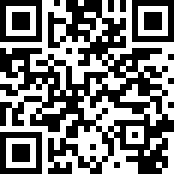

# Hunger 
> Stylish product landing page
> 
<a href="https://username1111111111.github.io/Hunger/">Live demo here</a>

> 
Or 👇:

## Table of Contents
* [General Info](#general-information)
* [Highlights](#highlights)
* [Screenshots](#screenshots)
* [Usage](#usage)
* [Contact](#contact)

## General Information
- This was done as a FreeCodeCamp graduate project.
- It was inteded for practice with CSS variables, style improvment, continuing gaining experience in layout

## Highlights
- Custom logos, with sense of humor
- Fontawesome
- CSS variables
- Font border
- \<video> tag
- Apple-alike style

## Screenshots

## Usage
Just clone the repo and open **index.html** in a browser 👍

## Contact

<a style="text-decoration: none;"href="https://github.com/Username1111111111/Username1111111111">@Username1111111111</a>
 
  
The Frontend developer 

   💪

